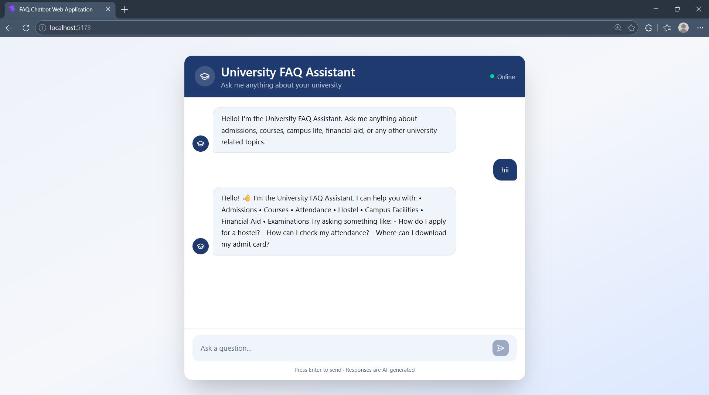
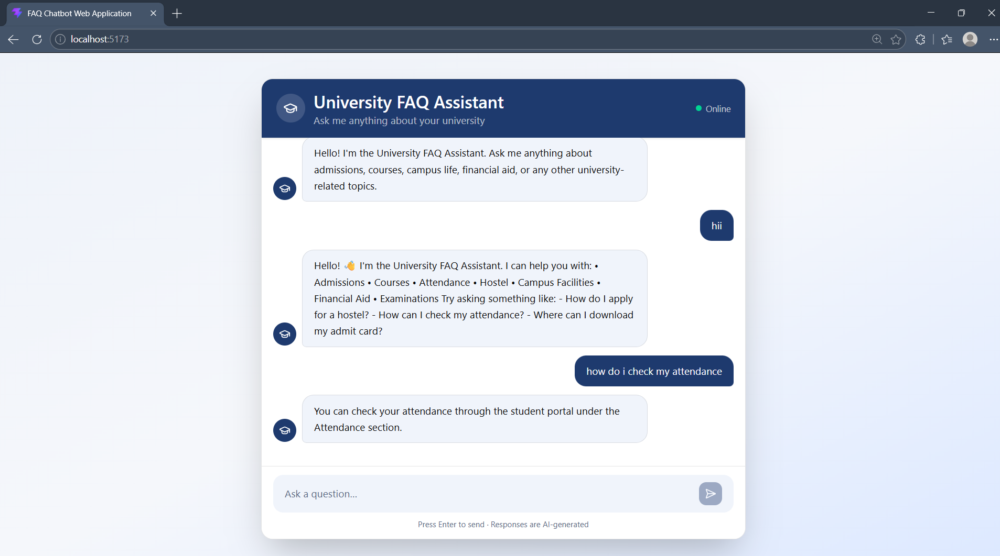

# 🎓 University FAQ Chatbot

A smart FAQ Chatbot built using **React**, **FastAPI**, and **Natural Language Processing (NLP)** techniques. The chatbot helps users find answers to frequently asked university-related questions by matching their queries with a predefined FAQ database using **TF-IDF Vectorization** and **Cosine Similarity**.

---

## 🚀 Features

* Interactive chatbot interface
* React-based frontend
* FastAPI backend
* FAQ dataset stored in JSON format
* NLP-powered question matching
* TF-IDF vectorization for text representation
* Cosine similarity for finding the most relevant FAQ
* Similarity threshold to handle unrelated questions
* Real-time communication between frontend and backend
* Responsive and modern user interface

---

## 🛠️ Tech Stack

### Frontend

* React
* TypeScript
* Tailwind CSS

### Backend

* FastAPI
* Python

### NLP & Machine Learning

* Scikit-learn
* TF-IDF Vectorizer
* Cosine Similarity

---

## 📂 Project Structure

```text
faq-chatbot/
│
├── frontend/
│   ├── src/
│   ├── public/
│   └── package.json
│
├── backend/
│   ├── chatbot.py
│   ├── main.py
│   └── faq.json
│
└── README.md
```

---

## Screenshots





## ⚙️ How It Works

1. The user enters a question in the chatbot interface.
2. The frontend sends the query to the FastAPI backend.
3. The backend preprocesses the query and converts it into a TF-IDF vector.
4. Cosine similarity is calculated between the user query and all stored FAQ questions.
5. The most relevant FAQ is selected.
6. If the similarity score is above a predefined threshold, the corresponding answer is returned.
7. Otherwise, the chatbot responds that no relevant answer was found.

---

## 📦 Installation

### Clone the Repository

```bash
git clone <your-repository-url>
cd faq-chatbot
```

---

### Backend Setup

```bash
cd backend

python -m venv venv

# Windows
venv\Scripts\activate

pip install fastapi uvicorn scikit-learn
```

Start the backend server:

```bash
uvicorn main:app --reload
```

Backend will run on:

```text
http://127.0.0.1:8000
```

---

### Frontend Setup

```bash
cd frontend

npm install

npm run dev
```

Frontend will run on:

```text
http://localhost:5173
```

---

## 🧪 Example Queries

* How do I reset my password?
* How can I check my attendance?
* How do I apply for a hostel?
* Where can I download my admit card?
* How can I access campus Wi-Fi?

---

## 🎯 Future Improvements

* Database integration
* User authentication
* Larger FAQ datasets
* Speech-to-text support
* Multi-language support
* Advanced NLP models
* Chat history persistence

---
## Purpose

Developed as part of the CodeAlpha Internship Program.
